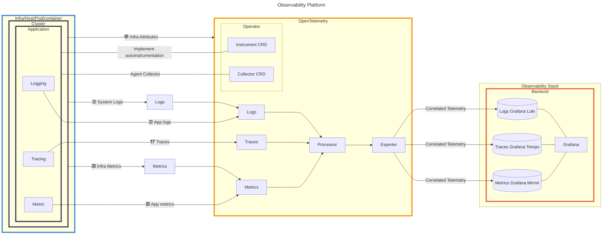
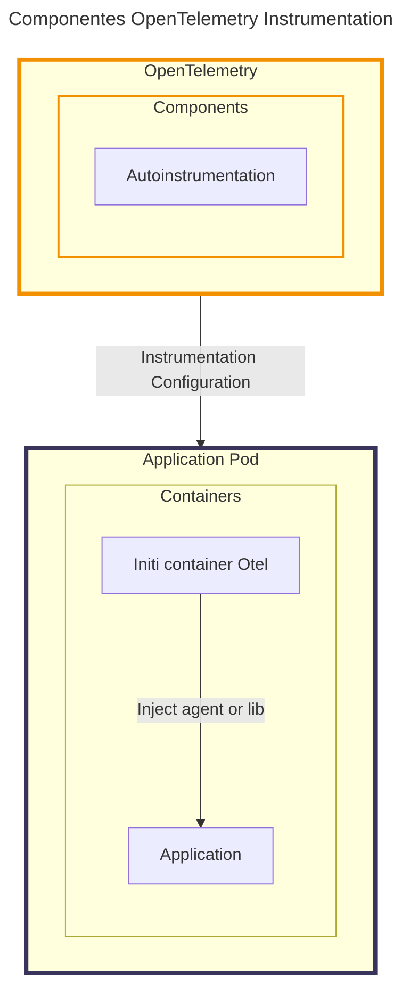
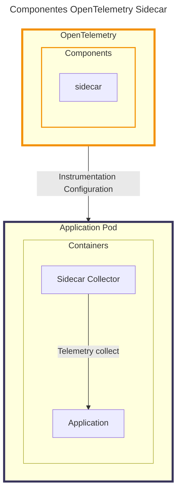

# Observability Platform

Plataforma de observabilidade (no formato de um MVP) que seja capaz de implementar instrumentação automática e gerenciamento de telemetria para sistemas em ambientes Kubernetes, reduzindo a complexidade e maximizando a eficiência operacional dos times. 



### Componente Intrumentação Automática

O Resource Instrumentation do Operator OponTelemetry implementa as configurações necessárias no Pod, através do Init Container injentando agentes ou biblioteca do OpenTelemetry, permitindo a geração, colete e envio dos dados de telemetria.



### Componente Sidecar OpenTelemetry Collector

O Resource Sidecar do Operator OponTelemetry cria um segundo container no Pod da aplicação que será responsável pela coleta e transporte dos dados de telemetria.



### Componente OpenTelemetry Collector

O Resource Collector do Operator OponTelemetry é responsável por centralizar o recebimento e processamento de diversas fontes do cluster Kubernetes e encaminhar os dados para um ou mais provedores de observabilidade.

---
title: Componentes OpenTelemetry Collector
---

graph

subgraph openTelemetry["OpenTelemetry"]
  style openTelemetry stroke:#f39000,stroke-width:4px;
  subgraph components["Components"]
    style components stroke:#f39000,stroke-width:2px;
    collector["collector"]
  end
end

subgraph application["Application Pod with sidecar"]
  style application stroke:#4d7eb7,stroke-width:4px;
  subgraph container["Containers"]
    app-sidecar["Sidecar Collector"]
    app["Application"]
  end
end

subgraph application2["Application Pod"]
  style application2 stroke:#4d7eb7,stroke-width:4px;
  subgraph container2["Containers"]
    app2["Application"]
  end
end

subgraph cluster["Kubernetes"]
style cluster stroke:#4d7eb7,stroke-width:4px;
node["Nodes"]
control["Control Plane"]
runtime["Container Runtime"]
controllers["Contollers"]
schedule["Scheduler"]
end

subgraph backend["Observability Backend"]
style backend stroke:#4d7eb7,stroke-width:4px;
Trace
Metric
Log
end


application --->|Sending Telemetry data| openTelemetry
application2 --->|Sending Telemetry data| openTelemetry
app-sidecar --->|"Telemetry collect"| app
cluster --->|Sending Telemetry data| openTelemetry
openTelemetry ---> Trace
openTelemetry ---> Metric
openTelemetry ---> Log

## Requisitos

- [Docker](https://docs.docker.com/engine/install/)
- [Kubectl](https://kubernetes.io/pt-br/docs/tasks/tools/#kubectl)
- [Helm](https://helm.sh/docs/intro/install/)

## Ajuda

Para ajuda, digite o comando a seguir no dirátorio raiz do projeto. 

```shell
make help
```
Saída:

```shell
help                 "This help"
install-kind         "Instala kind"
create-cluster       "Cria cluster Kind com balanceador, ingress-nginx, cert-manager e metrics-server"
delete-cluster       "Exclui cluster Kind"
display-cluster      "Exibe informações do cluster"
deploy-platform      "Implata plataforma de observabilidade"
deploy-applications  "Implata aplicações de exemplo"
```
