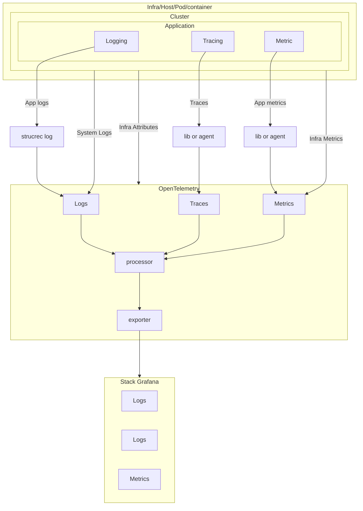

# Observability Platform

Plataforma de observabilidade (no formato de um MVP) que seja capaz de implementar instrumentação automática e gerenciamento de telemetria para sistemas em ambientes Kubernetes, reduzindo a complexidade e maximizando a eficiência operacional dos times. 

