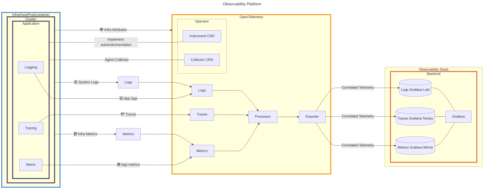
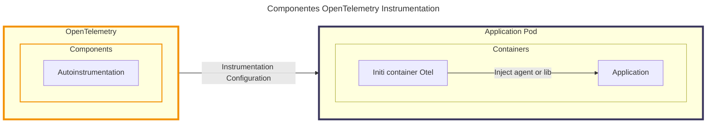
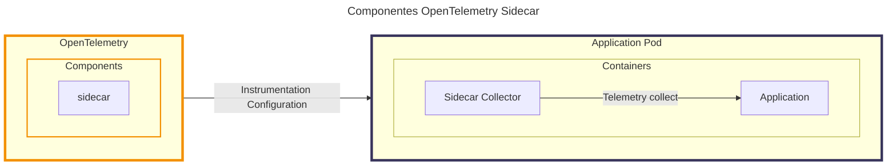
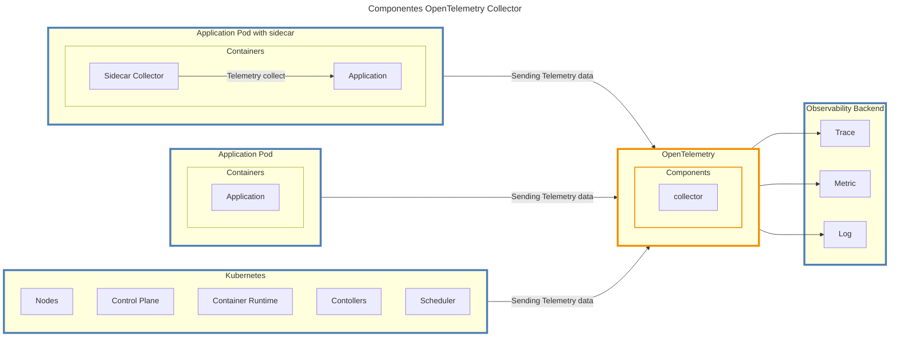

# Observability Platform

Plataforma de observabilidade (no formato de um MVP) que seja capaz de implementar instrumentação automática e gerenciamento de telemetria para sistemas em ambientes Kubernetes, reduzindo a complexidade e maximizando a eficiência operacional dos times. 



### Componente Intrumentação Automática

O Resource Instrumentation do Operator OponTelemetry implementa as configurações necessárias no Pod, através do Init Container injentando agentes ou biblioteca do OpenTelemetry, permitindo a geração, colete e envio dos dados de telemetria.



### Componente Sidecar OpenTelemetry Collector

O Resource Sidecar do Operator OponTelemetry cria um segundo container no Pod da aplicação que será responsável pela coleta e transporte dos dados de telemetria dos serviços que não suportam o envio dos dados diretamente para o collector central.



### Componente OpenTelemetry Collector

O Resource Collector do Operator OponTelemetry é responsável por centralizar o recebimento e processamento de diversas fontes do cluster Kubernetes e encaminhar os dados para um ou mais provedores de observabilidade.



## Requisitos

- [Docker](https://docs.docker.com/engine/install/)
- [Kubectl](https://kubernetes.io/pt-br/docs/tasks/tools/#kubectl)
- [Helm](https://helm.sh/docs/intro/install/)

## Ajuda

Para ajuda, digite o comando a seguir no dirátorio raiz do projeto. 

```shell
make help
```
Saída:

```shell
help                 "Ajuda"
install-kind         "Instala kind"
create-cluster       "Cria cluster K8s com balanceador, ingress-nginx, cert-manager e metrics-server"
configure-dns        "Configuração DNS"
delete-cluster       "Exclui cluster Kubernetes"
display-cluster      "Exibe informações do cluster"
deploy-platform      "Implanta plataforma de observabilidade"
deploy-applications  "Implanta aplicações de exemplo"
delete-applications  "Exclui aplicações de exemplo"
```

### Criar Cluster Kubernetes

Execute o comando a seguir:

```shell
make create-cluster
```

> Em caso de erro, execute o comando novamente.

### Criar Plataforma de Observabilidade

Execute o comando a seguir:

```shell
make deploy-platform
```

> Em caso de erro, execute o comando novamente.

### Criar Aplicações de Exemplo

Execute o comando a seguir:

```shell
make deploy-applications 
```

> Em caso de erro, execute o comando novamente.


## Acessando Plataforma de Observabilidade Local

- Link Grafana Web: http://observability.platform.local
- Usuário: admin
- Senha: admin

## Plataforma Envia dados para Grafana Cloud

Antes de implantar o OpenTelemetry Collector com Exporter Grafana Cloud, é necessário criar as secrets com os tokens do provider.

```yaml
apiVersion: v1
data:
  token: <SET TOKEN IN BASE64>
kind: Secret
metadata:
  name: grafana-secret
  namespace: observability
```

> Para encriptar base64: `echo "SET O TOKEN HERE" | base64`

Copie e cole o valor no arquivo `./opentelemetry/secret-grafana-cloud.yaml`

Execute o comando a seguir: 

```shell
make deploy-platform-grafana-cloud
```

## Erros Conhecidos

Erro: `failed to create fsnotify watcher: too many open files`, ocorre quando o OpenTelemetry Collector não consegue criar um observador de sistema de arquivos (fsnotify) devido a um limite de arquivos abertos excedido. Para resolver esse problema, você precisa ajustar os recursos do sistema operacional para permitir um número maior de arquivos abertos.

Execute o comando a seguir

```shell
sudo sysctl fs.inotify.max_user_watches=524288
sudo sysctl fs.inotify.max_user_instances=512
```

[Referência: Erros de pod devido a “muitos arquivos abertos”](https://kind.sigs.k8s.io/docs/user/known-issues/#pod-errors-due-to-too-many-open-files)

## Resultados

3.1 Resultados

Observar sistemas é um dos elementos mais importantes para solucionar problemas de desempenho, segurança, escalabilidade e disponibilidade. Nesse contexto, a plataforma de observabilidade desempenha um papel fundamental ao proporcionar instrumentação automática para sistemas executados no Kubernetes. Essa abordagem automatizada simplifica a coleta, processamento e envio de dados de telemetria, permitindo uma análise eficaz do comportamento do sistema em tempo real.
A proposta apresentada neste documento trará benefícios para os times de engenharia e operações. Uma vez que, facilitará a entrega de software com maior confiabilidade, reduzindo a carga operacional, assegura um mínimo de observabilidades para os sistemas, contribuindo para a resolução de problemas com maior rapidez e eficiência, além de difundir a cultura de observabilidade entre os times.
A instrumentação automática elimina a necessidade de adicionar mais linhas de código no desenvolvimento do software. É importante considerar a autoinstrumentação como um dos primeiros passos para uma compreensão adequada do comportamento do sistema. Posteriormente, podemos incorporar a instrumentação manual para obter informações de telemetria de alta qualidade.
Os dados coletados pela plataforma de observabilidade são acrescidos de dados abrangentes sobre o contexto de execução do sistema, incluindo metadados das tarefas executadas pelo software. Além disso, os dados de contexto de execução do sistema, incluem os metadados do provedor de nuvem, cluster, infraestrutura, recursos do kubernetes, contêiner entre outros. Os clientes têm a oportunidade de navegar entre diferentes camadas e tipos de dados de telemetria, métricas, trace e log, de modo a identificar a causa raiz do problema.
O núcleo da plataforma de observabilidade foi desenvolvido com as ferramentas do projeto OpenTelemetry. Essas ferramentas possibilitam a coleta, processamento e transporte dos dados de telemetria, agnóstico a ferramenta de monitoramento e analise. Essa flexibilidade proporciona aos usuários uma grande liberdade, eliminando de permanecer preso a uma ferramenta específica.

3.2 Contribuições

O progresso do projeto foi impulsionado pelas demandas específicas dos clientes, resultando em uma plataforma de observabilidade inovadora e flexível, inteiramente alinhadas às demandas do ecossistema de observabilidade. Uma das principais características é a implementação de autoinstrumentação simplificada, reduzindo o custo operacional dos times de engenharia e operações. 
Ao contrário de outras ferramentas, a plataforma de observabilidade se sobressai por sua integração nativa com ambiente Kubernetes, permitindo aos clientes a escolha da ferramenta de monitoramento e análise mais adequada para armazenar os dados de telemetria. Essa capacidade de escolha não apenas aumenta a eficiência operacional, como também facilita a adaptação a cenários de observabilidade mais complexos, consolidando a plataforma como uma solução focada no cliente e alinhada às demandas dinâmicas de sistemas distribuídos.
A introdução da coleta, processamento e envio automático de telemetria aprimora significativamente os padrões de observabilidade para sistemas executados no Kubernetes. Essa abordagem eficiente proporciona aos usuários uma melhor experiência para avaliar o comportamento do sistema em tempo real. A automação do gerenciamento de telemetria não apenas simplifica a implementação, mas também reduz o tempo necessário para identificar e solucionar problemas, contribuindo para uma resposta mais ágil a eventos críticos. 

3.3 Próximos passos

Enquanto progredimos no projeto, percebemos progressos significativos e a adição de recursos cruciais para aprimorar a eficiência da plataforma. Abaixo estão as propostas para as próximas etapas:
Customização da Coleta de Telemetria: 
Oferecer aos clientes a coleta de telemetria personalizada de acordo com as suas necessidades. Isso permitirá que os clientes especifiquem, por meio de labels ou annotations nos manifestos Kubernetes de suas aplicações, quais tipos de dados de telemetria desejam coletar. Por exemplo, os clientes poderão habilitar ou desabilitar a coleta de logs, traces e métricas através de valores booleanos (true ou false). Essa abordagem permitirá uma coleta mais precisa de dados essenciais, o que resultará em uma melhor utilização do monitoramento.
Escolha da Ferramenta de Monitoramento:
Os clientes podem escolher para qual ferramenta de monitoramento os dados de telemetria devem ser enviados. Ao inserir chaves-valor nos manifestos Kubernetes de suas aplicações, os clientes terão a opção de escolher entre diversas ferramentas de monitoramento e analise, como Datadog, Grafana, New Relic, entre outras. Essa flexibilidade assegura que a plataforma se integre perfeitamente ao ecossistema de monitoramento preferido de cada cliente, proporcionando uma experiência verdadeiramente personalizada.
Aprimoramento Contínuo:
Além disso, estamos sempre aperfeiçoando a plataforma de observabilidade. Isso inclui a expansão das integrações com uma variedade ainda maior de ferramentas de monitoramento e análise, garantindo a segurança e conformidade no manuseio dos dados sensíveis de telemetria. Paralelamente, estamos dedicados a fornecer treinamentos abrangentes e documentação de alta qualidade para capacitar nossos clientes a tirar o máximo proveito da plataforma. Essas melhorias mostram que queremos oferecer uma solução completa e evolutiva para atender às necessidades crescentes da observabilidade.
